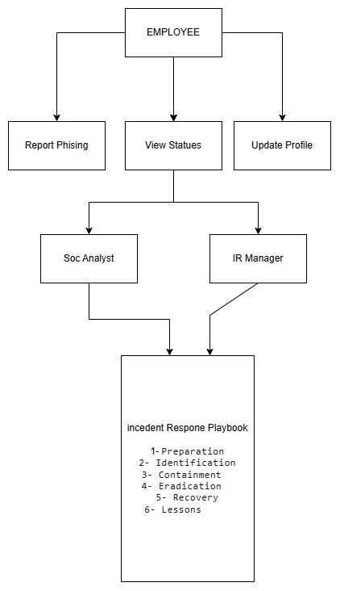
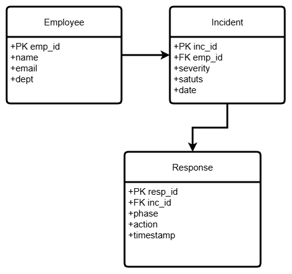
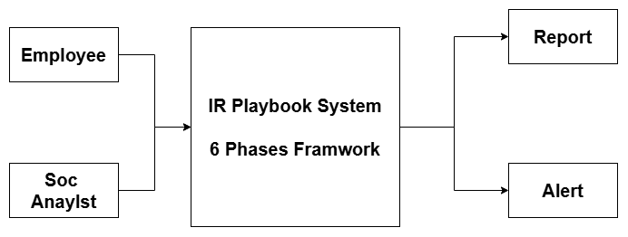
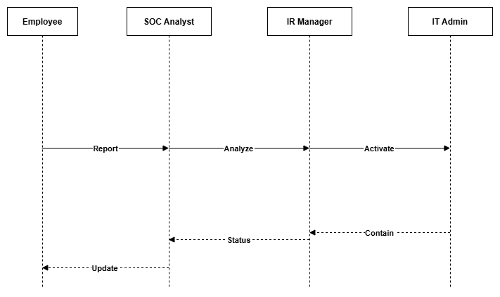

# Final Report: Incident Response Playbook for Phishing Attacks

---

## 1. Introduction

### 1.1 Project Title
Development of an Incident Response Playbook for Phishing Attacks

### 1.2 Team Members
| Name | Role |
|------|------|
| Mohamed Ahmed Mohamed El-Abbasy | Project Manager |
| Omar Sherif Ibrahim | Lead Analyst |
| Mohamed Hesham Farouk | Security Specialist |
| Khaled Saeed Abdel-Maaboud | Documentation Lead |

### 1.3 Project Objective
Design a structured and practical Incident Response Playbook to effectively detect, contain, eradicate, and recover from phishing attacks within an organization.

### 1.4 Scope
- **In Scope**: Phishing incident response procedures, simulation scenario, UML documentation
- **Out of Scope**: Implementation, testing, non-phishing attacks

---

## 2. Project Planning & Management

### 2.1 Timeline
| Phase | Start | End | Status |
|-------|-------|-----|--------|
| Planning | 2026-02-01 | 2026-02-20 | ✅ Complete |
| Literature Review | 2026-02-21 | 2026-03-10 | ✅ Complete |
| Requirements | 2026-03-11 | 2026-03-25 | ✅ Complete |
| System Analysis & Design | 2026-03-26 | 2026-04-20 | ✅ Complete |

### 2.2 Risk Assessment
| Risk | Impact | Mitigation |
|------|--------|------------|
| Delay in research | High | Early start, divide topics |
| Scope creep | High | Stick to design phase only |

### 2.3 KPIs
- MTTR (Mean Time To Respond) &lt; 30 minutes
- Playbook compliance &gt; 95%
- Employee reporting rate &gt; 80%

---

## 3. Literature Review

### 3.1 Existing Frameworks
**NIST SP 800-61**: 4-phase incident handling guide widely adopted in industry.

**SANS Incident Handler's Handbook**: Practical 6-phase approach with detailed checklists.

**MITRE ATT&CK T1566**: Specific technique for phishing attacks with sub-techniques.

### 3.2 Gap Analysis
| Existing | Our Playbook |
|----------|--------------|
| Generic procedures | Specific to phishing |
| No simulation included | Includes realistic simulation |
| Limited visual documentation | Full UML diagrams |

---

## 4. Requirements Gathering

### 4.1 Stakeholders
- CISO (High Interest, High Influence)
- SOC Analyst (High Interest, Medium Influence)
- IT Administrator (Medium Interest, Medium Influence)
- Employee (Medium Interest, Low Influence)

### 4.2 Functional Requirements
1. Report suspicious emails
2. Classify incident severity
3. Activate playbook procedures
4. Track incident status
5. Generate reports

### 4.3 Non-Functional Requirements
- Response time &lt; 2 seconds
- 99.9% availability
- Encrypted data storage
- Role-based access control

---

## 5. System Analysis & Design

### 5.1 Use Case Diagram

**Actors**: Employee, SOC Analyst, IR Manager, IT Administrator

**Key Use Cases**:
- Report Phishing Email
- Analyze Suspicious Email
- Classify Incident
- Activate Playbook
- Contain Threat
- Eradicate Threat
- Generate Report

### 5.2 System Architecture
**Architecture Style**: Layered Architecture
┌─────────────────────────────────┐
│    Presentation Layer           │
│    (Playbook Interface)         │
├─────────────────────────────────┤
│    Business Logic Layer         │
│    (Procedures & Workflows)     │
├─────────────────────────────────┤
│    Data Layer                   │
│    (Incident Database)          │
├─────────────────────────────────┤
│    Integration Layer            │
│    (SIEM, Email Gateway)        │
└─────────────────────────────────┘

### 5.3 Database Design (ER Diagram)

**Entities**:
- **Employee**: emp_id, name, email, department
- **Incident**: incident_id, emp_id, severity, status, date
- **PhishingEmail**: email_id, sender, subject, malicious_links
- **ResponseTeam**: team_id, name, role, contact
- **ActionLog**: log_id, incident_id, action, timestamp

### 5.4 Data Flow Diagram

**External Entities**: Employee, SOC Analyst, IR Manager
**Process**: Incident Response Playbook System
**Data Stores**: Incident Database, Action Log

### 5.5 Sequence Diagram

**Scenario**: Employee reports phishing → SOC Analyst analyzes → IR Manager activates playbook → IT Admin contains threat

---

## 6. Incident Response Playbook

### 6.1 Framework Overview
6-phase framework aligned with MITRE ATT&CK T1566:

| Phase | Objective | Key Actions |
|-------|-----------|-------------|
| 1. Preparation | Ready the team | Training, tool configuration |
| 2. Identification | Detect the threat | Email analysis, confirmation |
| 3. Containment | Stop the spread | Block sender, isolate endpoint |
| 4. Eradication | Remove the threat | Delete malware, reset passwords |
| 5. Recovery | Restore operations | System restore, monitoring |
| 6. Lessons Learned | Improve future response | Documentation, updates |

### 6.2 Simulation Scenario
**Scenario**: Employee receives phishing email disguised as bank notification

**Timeline**:
- 09:00 - Phishing email received
- 09:15 - Employee clicks link, enters credentials
- 09:30 - Employee reports suspicious activity
- 09:45 - SOC Analyst confirms phishing attack
- 10:00 - IR Manager activates Phase 2 (Identification)
- 10:30 - Phase 3 (Containment) initiated
- 12:00 - Phase 4 (Eradication) complete
- 14:00 - Phase 5 (Recovery) finished
- Next day - Phase 6 (Lessons Learned) meeting

---

## 7. Conclusion

### 7.1 Achievements
✅ Comprehensive 6-phase playbook designed
✅ Aligned with MITRE ATT&CK T1566
✅ Realistic simulation scenario developed
✅ Complete UML documentation
✅ Clear stakeholder roles defined

### 7.2 Future Work
- Implement automated playbook activation
- Integrate with SIEM tools
- Develop mobile app for incident reporting
- Add machine learning for phishing detection

---

## 8. References

1. NIST. (2012). *SP 800-61 Rev. 2: Computer Security Incident Handling Guide*
2. MITRE. (2024). *ATT&CK Framework v14 - Technique T1566: Phishing*
3. SANS Institute. (2023). *Incident Handler's Handbook*
4. Cichonski, P., et al. (2012). *Computer Security Incident Handling Guide*. NIST Special Publication 800-61.

---

## Appendices

### Appendix A: Team Task Assignment
| Member | Tasks |
|--------|-------|
| Mohamed Abbasy | Project management, Sequence diagram |
| Omar Sherif | Literature review, DFD |
| Mohamed Hesham | Playbook content, Architecture |
| Khaled Said | Documentation, ER diagram, Use case |

### Appendix B: Glossary
| Term | Definition |
|------|------------|
| IR | Incident Response |
| SOC | Security Operations Center |
| MTTR | Mean Time To Respond |
| SIEM | Security Information and Event Management |
| MITRE ATT&CK | Adversarial Tactics, Techniques, and Common Knowledge |

